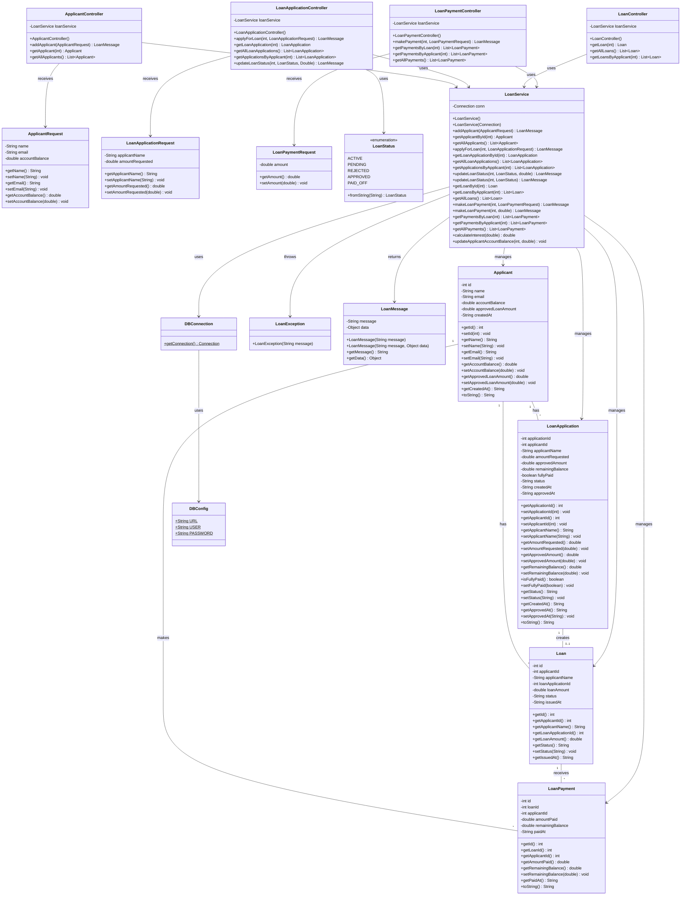

```mermaid
classDiagram
    direction TB
    
    %% Models
    class Applicant {
        -int id
        -String name
        -String email
        -double accountBalance
        -double approvedLoanAmount
        -String createdAt
        +getId() int
        +setId(int) void
        +getName() String
        +setName(String) void
        +getEmail() String
        +setEmail(String) void
        +getAccountBalance() double
        +setAccountBalance(double) void
        +getApprovedLoanAmount() double
        +setApprovedLoanAmount(double) void
        +getCreatedAt() String
        +toString() String
    }

    class LoanApplication {
        -int applicationId
        -int applicantId
        -String applicantName
        -double amountRequested
        -double approvedAmount
        -double remainingBalance
        -boolean fullyPaid
        -String status
        -String createdAt
        -String approvedAt
        +getApplicationId() int
        +setApplicationId(int) void
        +getApplicantId() int
        +setApplicantId(int) void
        +getApplicantName() String
        +setApplicantName(String) void
        +getAmountRequested() double
        +setAmountRequested(double) void
        +getApprovedAmount() double
        +setApprovedAmount(double) void
        +getRemainingBalance() double
        +setRemainingBalance(double) void
        +isFullyPaid() boolean
        +setFullyPaid(boolean) void
        +getStatus() String
        +setStatus(String) void
        +getCreatedAt() String
        +getApprovedAt() String
        +setApprovedAt(String) void
        +toString() String
    }

    class Loan {
        -int id
        -int applicantId
        -String applicantName
        -int loanApplicationId
        -double loanAmount
        -String status
        -String issuedAt
        +getId() int
        +getApplicantId() int
        +getApplicantName() String
        +getLoanApplicationId() int
        +getLoanAmount() double
        +getStatus() String
        +setStatus(String) void
        +getIssuedAt() String
    }

    class LoanPayment {
        -int id
        -int loanId
        -int applicantId
        -double amountPaid
        -double remainingBalance
        -String paidAt
        +getId() int
        +getLoanId() int
        +getApplicantId() int
        +getAmountPaid() double
        +getRemainingBalance() double
        +setRemainingBalance(double) void
        +getPaidAt() String
        +toString() String
    }

    %% DTOs
    class ApplicantRequest {
        -String name
        -String email
        -double accountBalance
        +getName() String
        +setName(String) void
        +getEmail() String
        +setEmail(String) void
        +getAccountBalance() double
        +setAccountBalance(double) void
    }

    class LoanApplicationRequest {
        -String applicantName
        -double amountRequested
        +getApplicantName() String
        +setApplicantName(String) void
        +getAmountRequested() double
        +setAmountRequested(double) void
    }

    class LoanPaymentRequest {
        -double amount
        +getAmount() double
        +setAmount(double) void
    }

    %% Enums
    class LoanStatus {
        <<enumeration>>
        ACTIVE
        PENDING
        REJECTED
        APPROVED
        PAID_OFF
        +fromString(String) LoanStatus
    }

    %% Exception Classes
    class LoanException {
        +LoanException(String message)
    }

    class LoanMessage {
        -String message
        -Object data
        +LoanMessage(String message)
        +LoanMessage(String message, Object data)
        +getMessage() String
        +getData() Object
    }

    %% Service
    class LoanService {
        -Connection conn
        +LoanService()
        +LoanService(Connection)
        +addApplicant(ApplicantRequest) LoanMessage
        +getApplicantById(int) Applicant
        +getAllApplicants() List~Applicant~
        +applyForLoan(int, LoanApplicationRequest) LoanMessage
        +getLoanApplicationById(int) LoanApplication
        +getAllLoanApplications() List~LoanApplication~
        +getApplicationsByApplicant(int) List~LoanApplication~
        +updateLoanStatus(int, LoanStatus, double) LoanMessage
        +updateLoanStatus(int, LoanStatus) LoanMessage
        +getLoanById(int) Loan
        +getLoansByApplicant(int) List~Loan~
        +getAllLoans() List~Loan~
        +makeLoanPayment(int, LoanPaymentRequest) LoanMessage
        +makeLoanPayment(int, double) LoanMessage
        +getPaymentsByLoan(int) List~LoanPayment~
        +getPaymentsByApplicant(int) List~LoanPayment~
        +getAllPayments() List~LoanPayment~
        +calculateInterest(double) double
        +updateApplicantAccountBalance(int, double) void
    }

    %% Controllers
    class ApplicantController {
        -LoanService loanService
        +ApplicantController()
        +addApplicant(ApplicantRequest) LoanMessage
        +getApplicant(int) Applicant
        +getAllApplicants() List~Applicant~
    }

    class LoanApplicationController {
        -LoanService loanService
        +LoanApplicationController()
        +applyForLoan(int, LoanApplicationRequest) LoanMessage
        +getLoanApplication(int) LoanApplication
        +getAllLoanApplications() List~LoanApplication~
        +getApplicationsByApplicant(int) List~LoanApplication~
        +updateLoanStatus(int, LoanStatus, Double) LoanMessage
    }

    class LoanController {
        -LoanService loanService
        +LoanController()
        +getLoan(int) Loan
        +getAllLoans() List~Loan~
        +getLoansByApplicant(int) List~Loan~
    }

    class LoanPaymentController {
        -LoanService loanService
        +LoanPaymentController()
        +makePayment(int, LoanPaymentRequest) LoanMessage
        +getPaymentsByLoan(int) List~LoanPayment~
        +getPaymentsByApplicant(int) List~LoanPayment~
        +getAllPayments() List~LoanPayment~
    }

    %% Config
    class DBConfig {
        +String URL$
        +String USER$
        +String PASSWORD$
    }

    class DBConnection {
        +getConnection()$ Connection
    }

    %% Relationships
    
    %% Model Relationships
    Applicant "1" -- "*" LoanApplication : has
    Applicant "1" -- "*" Loan : has
    Applicant "1" -- "*" LoanPayment : makes
    LoanApplication "1" -- "0..1" Loan : creates
    Loan "1" -- "*" LoanPayment : receives

    %% Controller-Service Dependencies
    ApplicantController --> LoanService : uses
    LoanApplicationController --> LoanService : uses
    LoanController --> LoanService : uses
    LoanPaymentController --> LoanService : uses

    %% Service-Model Dependencies
    LoanService --> Applicant : manages
    LoanService --> LoanApplication : manages
    LoanService --> Loan : manages
    LoanService --> LoanPayment : manages
    LoanService --> DBConnection : uses

    %% DTO Usage
    ApplicantController --> ApplicantRequest : receives
    LoanApplicationController --> LoanApplicationRequest : receives
    LoanPaymentController --> LoanPaymentRequest : receives
    LoanApplicationController --> LoanStatus : uses

    %% Exception Usage
    LoanService --> LoanException : throws
    LoanService --> LoanMessage : returns

    %% Config
    DBConnection --> DBConfig : uses
```
